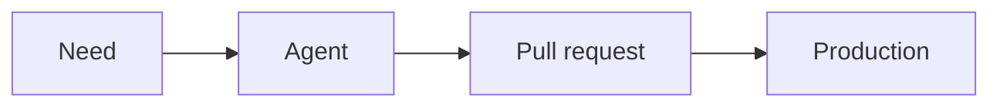

# Slide Documentation (Markdown-first Format)

This document describes the recommended format for building slides with `generate.py`.

## Principles

- Slide blocks are separated by a `---` line.
- Each new slide starts with `---type` (for example, `---content`, `---image`).
- The content of a block is written in Markdown:
- `#` for the main slide title
- `##` for the subtitle or heading
- `###` for the label (and some fields depending on the type)
- Some slide types support options defined with `key: value` properties.

## Comments and Speaker Notes

A line beginning with `>>` is a note for the speaker. It is removed from the visible slide content and kept in the **Speaker Notes** panel, which is available during the presentation through the `Notes` button or the `N` key.

```md
---content
# Training a model vs. inference
>> Emphasize the difference between learning and using the model.
>> Give the example of a model trained once and queried multiple times.
- Training: the model learns from data.
- Inference: the model produces an answer using its learned parameters.
```

Notes can be placed anywhere in a slide block. The `>>` prefix must appear at the beginning of the line, after any optional whitespace. They are not displayed on the slide and are not included in the PDF export.

## Global Front Matter

YAML front matter lets you manage presentation metadata:

```md
---
presentation-title: ...
speaker-name: ...
theme: corpo
footer:
  left: ...
  center: ...
  right: ...
---
```

The `theme` key is optional. It defaults to `corpo`, the current AXA-style theme. Set `theme: corail` to use the airy, coral-colored theme with handwritten headings.

## Markdown Mapping by Slide Type

- `main slide title` => `#`
- `subtitle` => `##` (displayed below the `#`)
- `label` => `###`
- `speaker` (slide title) => `####`
- `title` (legacy) => `#` for `---title`
- `heading` (legacy) => `#`
- `subtitle` (legacy) => `##`
- `speaker` (title slide) => `###`
- `content` lists:
- `- item` => unordered list
- `1. item` => ordered list
- `bullets` and `ordered` are no longer needed
- Free text in a `content` slide => legacy `text`
- `quote` slide: the quote text is written directly in the block (`quote:` is no longer needed)
- `image`: `src` and `alt` remain properties, while the caption uses `####`
- A Mermaid block in the text of a `content` or `bio` slide is rendered automatically
- `bio`: `src` and `alt` define the photo on the left, while free text and lists remain in the Markdown block on the right
- `stat` => `#`
- `stat-label` => `##`
- `caption` (stat) => `###`
- `speaker` (closing) => `##`
- `contact` (closing) => `###`

## Automatic Category Title (`display-category-title`)

When a presentation is structured into sections introduced by `---subtitle` slides, you no longer need to repeat the section title (`###`) on every slide in that section.

Use `display-category-title: false` on a slide to hide this automatic title.


> **Priority rule**: if an explicit label (`###` or `label:`) is present on the slide, it is used as-is and `display-category-title` is ignored.

> **Unaffected slides**: `---title`, `---agenda`, `---subtitle`, and `---closing` do not support this automatic title.

## Examples

### Title

```md
---title
### #security #ai #copilot · 2026
# I am not a security champion
## But I cut the number of vulnerabilities by 3 in one afternoon!
#### Johnathan MEUNIER - Staff Engineer 
```

### Subtitle 

```md
---subtitle
# 2. The AI Tax
## How code structure affects agent performance
```

### Content

```md
---content
### 01 - CXone?
# Why this topic now?
## Optional subtitle
The context has become critical since scans were rolled out widely.
- Key point 1
- Key point 2
```

### Ordered Content

```md
---content
### 03 - AI assistance
# Choose the priority packages
## Optional subtitle
1. Project type
2. Maintained project
3. Ease of deployment
```

### Quote

```md
---quote
### Suggested prompt
# Starting prompt
## Optional subtitle
This is a quote or a long prompt written directly in the block.
author: Copilot - auto
role: Johnathan MEUNIER 
```

### Stat

```md
---stat
### 4 - Result
# -72%
## in overall vulnerabilities
### simply by addressing the critical ones
```

### Cards

```md
---cards
# SOLID principles

card-1-title: S - Single Responsibility
card-1-body: One class, one reason to change.

card-2-title: O - Open/Closed Principle
card-2-body: Extend behavior without modifying existing code.

card-3-title: L - Liskov Substitution
card-3-body: Replace a base object without breaking behavior.
```

### Image

```md
---image
src: ./assets/full-width-screenshot.png
alt: Full screen screenshot
full-screen: true
```

### Iframe

```md
---iframe
src: https://tokens-lpj6s2duga-ew.a.run.app
scrolling: true
# Visualisation des tokens
```

Add `full-screen: true` to show only the iframe, with 30px side margins and space reserved for the slide header and footer. Other slide content is hidden.

### Closing

```md
---closing
# Any questions?
## Johnathan MEUNIER
### Staff Engineer 
inverse: true
src: ./assets/feedback.png
alt: Openfeedback QR code
```

### Bio

```md
---bio
src: ./assets/speaker.jpg
alt: Portrait of Johnathan MEUNIER
### Speaker
# Johnathan MEUNIER
## Staff Engineer 
Specialist in platform engineering, security, and applied AI.
- Runs dojos and conferences
- Designs agentic tools for teams
```

### Mermaid in a Slide

A Mermaid diagram can be written after a slide's text without creating a new slide type. When it is the last content, the closing fence is optional.

````md
---content
# The journey of a request

````

> **Note**: Mermaid rendering is loaded from `cdn.jsdelivr.net`; a network connection is therefore required when opening the presentation.

## Full-screen Image (`full-screen`)

On an `---image` slide, you can add `full-screen: true` to display the image full-screen without a title or caption. The image:
- Is never distorted (it uses `object-fit: contain`)
- Is centered on the slide
- Uses the maximum available height (taking the footer into account)
- Keeps its aspect ratio (portrait or landscape)

```md
---image
src: ./assets/full-width-screenshot.png
alt: Full screen screenshot
full-screen: true
```

> **Note**: when `full-screen: true`, the slide's `#`, `##`, `###`, and `####` fields are ignored. Only the image and footer are displayed.

## Inverted Variant (`inverse`)

The `inverse: true` parameter can be added to **any slide type** to switch the current slide's theme by inverting its colors.

This parameter applies **per slide**, not globally. Without it (or with `inverse: false`), the usual style remains unchanged.

```md
---content
inverse: true
# Resources
- 🎙️ [A link](https://example.com)
```

> **Compatible with all types**: `title`, `subtitle`, `agenda`, `content`, `bio`, `stat`, `stats-row`, `cards`, `quote`, `image`, `iframe`, `closing`.

## Compatibility

`generate.py` remains compatible with the legacy format (`heading:`, `bullets:`, `quote:`, etc.), but this Markdown-first format is now recommended.
